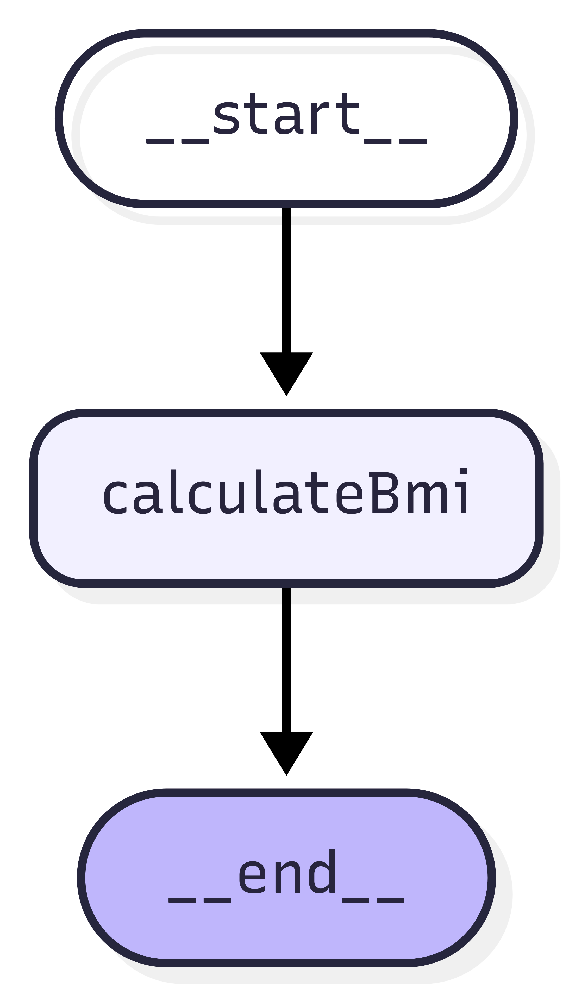
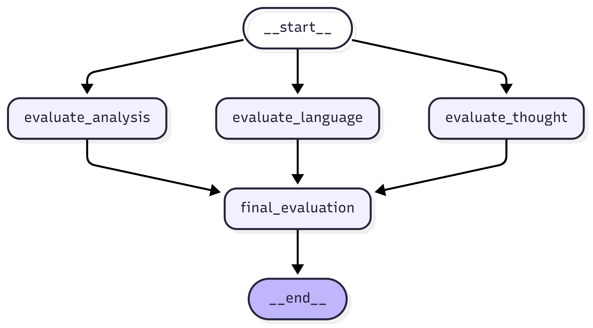
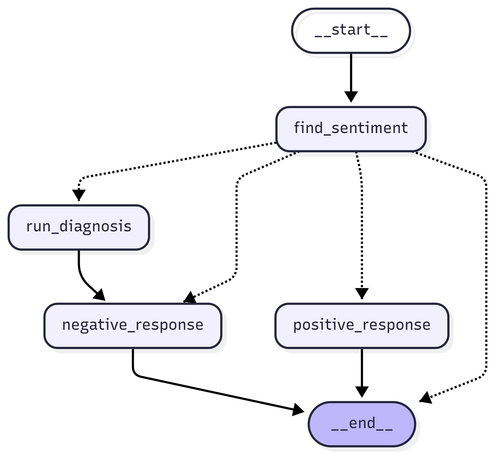

# Agentic AI practice with LangGraph and Langchain


## Features

### Sequential Workflow
- Calculate BMI based on height and weight.  
- Simple linear graph with a single node. 
BMI Calculator (Sequential Workflow)

Full URL : http://localhost:5000/bmi (Post)
```
{
  "height": 1.75, //meter
  "weight": 70  //kg
}
```


#### Workflow



### Parallel Workflow
- Evaluate essays in parallel on three aspects:
  1. Language quality  
  2. Depth of analysis  
  3. Clarity of thought  
- Aggregates individual scores and generates a final summary.  
- Demonstrates **LangGraph parallel execution** and **state management**.  

Full URL : http://localhost:5000/essay (Post)
```
{
  "essay": "put here your essay", //string
}
```

#### Workflow



---
### Conditional Workflow
- Detects sentiment (positive / negative).
- For positive reviews → generates a warm thank-you message.
- For negative reviews → runs a diagnosis (issue type, tone, urgency) and crafts a helpful support reply.
- Uses StateGraph workflow to manage logic flow.
- 
Full URL : http://localhost:5000/review (Post)
```
{
  "review": "put here your review", //string
}
```
#### Workflow



